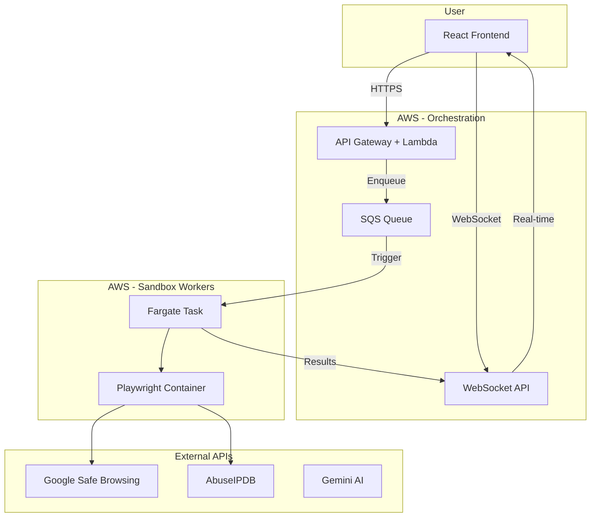

# Backend Architecture Plan

This document outlines the backend architecture for VaultScan, a security intelligence platform.

---

## Current Implementation: Option B (Hackathon MVP) ✅

For the hackathon, we implemented a **simplified local architecture** for speed:

```
┌─────────────────┐     ┌─────────────────┐     ┌─────────────────┐
│  React Frontend │────▶│  Node.js + WS   │────▶│  External APIs  │
│    (Vite)       │◀────│  (Fastify)      │◀────│  (GSB, Abuse)   │
└─────────────────┘     └─────────────────┘     └─────────────────┘
                               │
                               ▼
                        ┌─────────────────┐
                        │  Gemini AI API  │
                        │  (Chat Support) │
                        └─────────────────┘
```

**What we built:**
- Fastify server with Socket.io for real-time progress
- 13 security checks (SSL, headers, vulnerabilities, etc.)
- Direct API calls to Google Safe Browsing, AbuseIPDB
- Gemini AI chatbot for security Q&A

**Limitations:**
- No true sandbox isolation
- Scans run on the same server (not containerized)
- Not horizontally scalable

---

## Ideal Production Architecture: Option A (AWS CDK + Fargate)

For production, the recommended architecture uses **AWS infrastructure** for true isolation and scalability:



### Why Option A is Better for Production

| Aspect | Option B (Current) | Option A (Ideal) |
|--------|-------------------|------------------|
| **Isolation** | None | Full container isolation |
| **Scalability** | Single server | Auto-scaling Fargate tasks |
| **Security** | Runs in same process | Ephemeral containers per scan |
| **Cost** | Fixed server cost | Pay per scan |
| **Reliability** | Single point of failure | Distributed, fault-tolerant |

### Key Production Components

1. **API Gateway + Lambda** - Handles authentication, rate limiting
2. **SQS Queue** - Buffers scan requests, handles backpressure
3. **Fargate Tasks** - Ephemeral containers with Playwright for URL detonation
4. **WebSocket API** - Real-time progress updates to frontend
5. **Secrets Manager** - Secure API key storage

---

## Migration Path: B → A

To migrate from hackathon to production:

1. **Containerize the scanner**
   ```dockerfile
   FROM mcr.microsoft.com/playwright:v1.40.0
   COPY ./scanner /app
   RUN npm install
   CMD ["node", "scan.js"]
   ```

2. **Add SQS integration**
   - Replace Socket.io events with SQS messages
   - Fargate tasks poll the queue

3. **Deploy with CDK**
   ```bash
   cd infra
   cdk deploy VaultScanStack
   ```

4. **Add authentication**
   - Cognito for user auth
   - API keys for rate limiting

---

## Current Tech Stack

| Layer | Technology |
|-------|------------|
| Frontend | React + Vite + TypeScript |
| Backend | Node.js + Fastify + Socket.io |
| AI | Google Gemini API |
| Threat Intel | Google Safe Browsing, AbuseIPDB |
| Build | TypeScript, ESM modules |

## Production Tech Stack (Proposed)

| Layer | Technology |
|-------|------------|
| Frontend | React + CloudFront CDN |
| API | AWS API Gateway + Lambda |
| Queue | AWS SQS |
| Workers | AWS Fargate + Playwright |
| AI | Vertex AI / Gemini |
| Storage | DynamoDB (scan history) |
| Secrets | AWS Secrets Manager |
| IaC | AWS CDK (TypeScript) |
