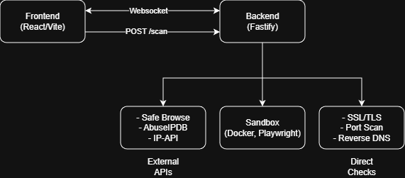

# NwHacks 2026

A comprehensive URL security scanner that analyzes QR codes and links for potential threats before users visit them. Built for nwHacks 2026.

## What It Does

X protects users from malicious URLs by running **10+ security checks** in real-time, including a sandboxed browser analysis that captures all network requests a website makes.

### Key Features

- **QR Code Scanning** — Scan QR codes with your camera to analyze the embedded URL
- **Link Analysis** — Paste any URL to get a full security report
- **Real-time Progress** — Watch each security check complete via WebSocket updates
- **Safety Score** — Get a 0-100 score based on combined threat indicators
- **PDF Reports** — Download detailed security reports

---

## Architecture

---

## 🔍 Security Checks

| # | Check | Description | Scoring Impact |
|---|-------|-------------|----------------|
| 1 | **Google Safe Browsing** | Checks against Google's malware/phishing database | Instant fail if threat found |
| 2 | **WHOIS Lookup** | Domain age and registrar info | -40 if domain < 7 days old |
| 3 | **SSL/TLS Certificate** | Validates cert, checks TLS version and cipher strength | -30 if invalid |
| 4 | **Geolocation** | Server location and ISP info | Informational |
| 5 | **Reverse DNS** | Verifies PTR records match hostname | -5 if no match |
| 6 | **Port Scan** | Scans for suspicious open ports (SSH, RDP, MySQL, etc.) | -15 if suspicious ports open |
| 7 | **IP Reputation** | Checks AbuseIPDB for abuse reports | -40 if high abuse score |
| 8 | **Security Headers** | Checks HTTP headers (CSP, HSTS, X-Frame-Options, etc.) | Up to -25 for poor grade |
| 9 | **Cookie Security** | Analyzes cookie flags (Secure, HttpOnly, SameSite) | -10 for insecure cookies |
| 10 | **Docker Sandbox** | Runs URL in isolated Playwright container, captures all network requests | -30 if >5 suspicious requests |

### Deep Scan (Optional)
| # | Check | Description |
|---|-------|-------------|
| 11 | **Sensitive Files** | Probes for exposed files (.env, .git, backups, etc.) |
| 12 | **Version Disclosure** | Checks for server version headers |
| 13 | **Admin Panels** | Scans for exposed admin interfaces |

---

## Docker Sandbox Analysis

The Docker sandbox visits the URL in an isolated browser and monitors all activity with **15+ threat detection categories**:

1. **Spins up a Playwright container** (`mcr.microsoft.com/playwright:v1.49.0-noble`)
2. **Visits the URL** and waits for the page to fully load
3. **Captures all network requests** the page makes
4. **Analyzes each request** with risk scoring and categorization

### Detection Categories

| Category | Description |
|----------|-------------|
| **Suspicious TLD** | Free/abused TLDs like `.xyz`, `.tk`, `.ml`, `.icu`, `.top`, `.monster` |
| **Phishing Keywords** | URLs containing `login`, `verify`, `secure`, `account`, `password`, etc. |
| **Brand Impersonation** | Domains mimicking PayPal, Netflix, Amazon, Microsoft, banks, etc. |
| **Malware Downloads** | Requests for `.exe`, `.scr`, `.bat`, `.msi`, `.jar`, `.ps1`, etc. |
| **Cryptominer Scripts** | Known mining domains like CoinHive, JSEcoin, CryptoLoot |
| **Tracking/Analytics** | Excessive third-party trackers (DoubleClick, Hotjar, Mixpanel) |
| **Data Exfiltration** | Long query strings, base64 payloads, suspicious POST data |
| **IP Direct Access** | Connections directly to IP addresses (bypassing DNS) |
| **Injection Attempts** | SQL injection, XSS, path traversal patterns |
| **C2 Patterns** | PHP endpoints with hash parameters (command & control) |
| **WordPress Exploits** | Requests to `/wp-admin`, `/wp-login`, `/wp-includes` |
| **Excessive Redirects** | Chains of redirects often used in phishing |
| **URL Obfuscation** | Unusual encoding, homoglyphs, Unicode tricks |

### Risk Scoring

Each suspicious request is assigned a risk level:

| Level | Score | Example |
|-------|-------|---------|
| **Critical** | 40 | Malware download, cryptominer, brand impersonation |
| **High** | 25 | Phishing keywords, suspicious TLD + keywords |
| **Medium** | 15 | Direct IP access, tracking overload |
| **Low** | 5 | Single suspicious indicator |

The overall risk (`safe` → `low` → `medium` → `high` → `critical`) is calculated from the total risk score of all requests.

**Requirements:** Docker Desktop must be running on the host machine.